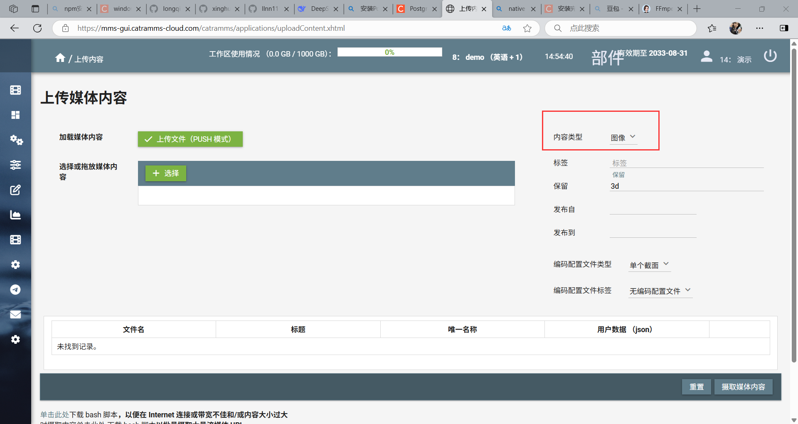
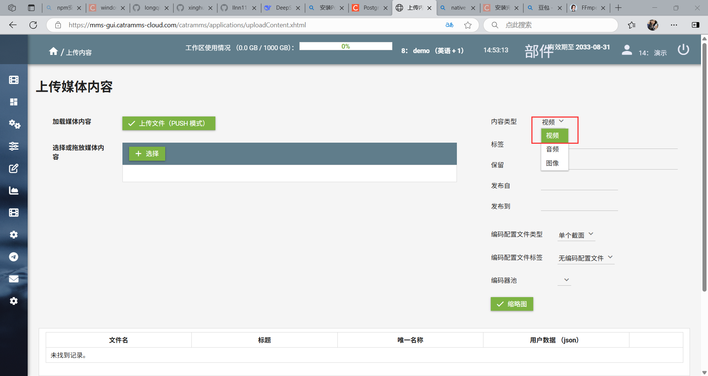
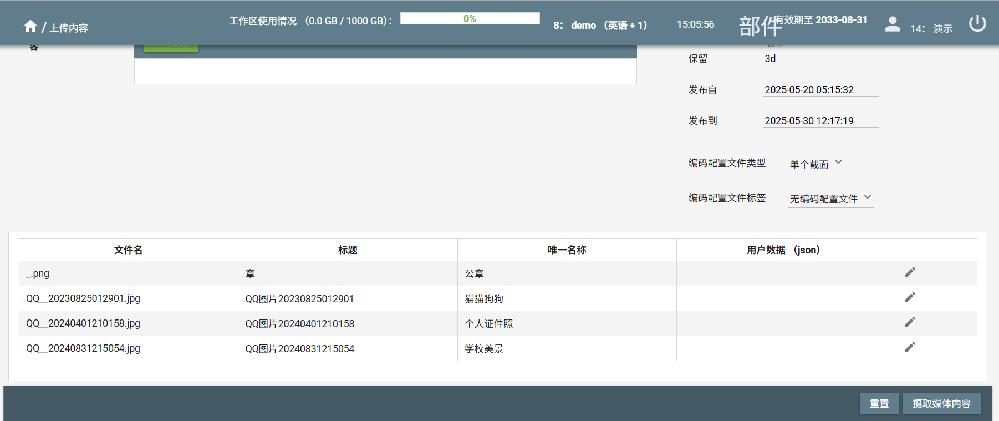
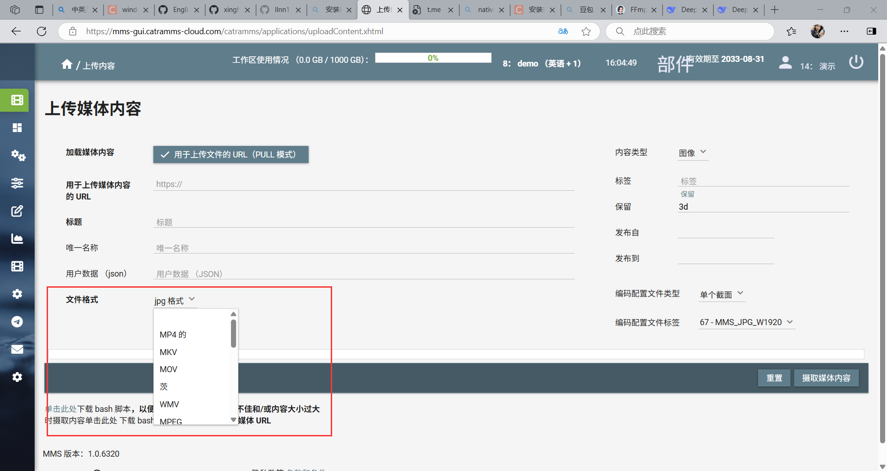

# English-practice
## 功能特性

## 内容摄入功能 <!-- by [龙青蜓] -->

CatraMMS 提供了一套灵活的内容摄入管道，支持多种内容摄入方式：

1. **本地文件上传**
    用户可以通过简单的文件选择界面上传本地文件。在脚本示例中，如 CatraMMS/scripts/examples/ingestOfImage/helper/ingestionWorkflow.sh 展示了相关操作，用户需要配置：
    用于身份验证的用户/API密钥
    元数据（标题、标签、保留策略）
    文件格式验证


    具体命令如下：
    ```bash
      if [ $# -ne 8 ]; then
          echo "Usage: $0 <mmsUserKey> <mmsAPIKey> <title> <tag> <ingester> <profileset> <retention> <fileFormat> ($#)"
          exit 1
      fi

      mmsAPIHostName=mms-api.cibortv-mms.com
      mmsUserKey=$1
      mmsAPIKey=$2
      title=$3
      tag=$4
      ingester=$5
      profileSet=$6
      retention=$7
      fileFormat=$8

      sed "s/\${title}/$title/g" ./helper/ingestionWorkflow.json | sed "s/\${tag}/$tag/g" | sed "s/\${ingester}/$ingester/g" | sed "s/\${profileSet}/$profileSet/g" | sed "s/\${retention}/$retention/g" | sed "s/\${fileFormat}/$fileFormat/g" > ./helper/ingestionWorkflow.json.new

      responseCode=$(curl -o ./helper/ingestionWorkflowResult.json -w "%{response_code}" -k -s -X POST -u $mmsUserKey:$mmsAPIKey -d @./helper/ingestionWorkflow.json.new -H "Content-Type: application/json" https://$mmsAPIHostName/catramms/1.0.1/workflow)
      if [ "$responseCode" -ne "201" ]; then
          echo "$(date +%Y-%m-%d-%H:%M:%S): FAILURE, Ingestion response code: $responseCode"
          exit 2
      fi

      rm ./helper/ingestionWorkflow.json.new

      #print ingestionJobKey
      jq '.tasks[] | select(.type == "Add-Content") | .ingestionJobKey' ./helper/ingestionWorkflowResult.json```
 



2. **云存储集成**
    支持通过sourceURL配置从第三方云服务提供商（如Google Drive、Dropbox）直接导入内容。虽然未使用特定的云SDK，但系统支持通过外部存储URL获取内容：
      ```json
      "parameters": {
          "sourceURL": "http://myhost/example.mp4",  // 支持HTTP/HTTPS/FTP/FTPS协议
          // ...
      }```


3. **批量导入**
    允许用户一次性导入多个文件，支持多种文件格式。CatraMMS/scripts/examples/ingestionOfStreamingURL/ingestionOfStreamingURL.sh 脚本展示了批量导入的思路，通过读取包含多个标题和流媒体 URL 的文件，依次对每个内容进行摄入操作：
      ```bash
      if [ $# -lt 8 ]; then
          echo "Usage: $0 <mmsUserKey> <mmsAPIKey> <tag> <ingester> <retention> <encodersPool> <encodingProfilesSet> <streamingURLFile>"
          echo "The current parameters number is: $#, it shall be 9"
          paramIndex=1
          for param in "$@"
          do
              echo "Param #$paramIndex: $param";
              paramIndex=$((paramIndex + 1));
          done
          exit 1
      fi

      mmsUserKey=$1
      mmsAPIKey=$2
      tag=$3
      ingester=$4
      retention=$5
      encodersPool=$6
      encodingProfilesSet=$7
      streamingURLFile=$8

      mmsAPIHostName=mms-api.catramms-cloud.com

      while read titleAndtreamingURL; do
          if [ "$titleAndtreamingURL" = "" ]; then
              continue
          fi

          title=$(echo $titleAndtreamingURL | cut -d ";" -f 1)
          streamingURL=$(echo $titleAndtreamingURL | cut -d ";" -f 2)
          encodedStreamingURL=${streamingURL//\//"\\/"}
          encodedStreamingURL=${encodedStreamingURL//\&/"\\&"}

          sed "s/\${title}/$title/g" ./helper/ingestionWorkflow.json | sed "s/\${streamingURL}/$encodedStreamingURL/g" | sed "s/\${tag}/$tag/g" | sed "s/\${ingester}/$ingester/g" | sed "s/\${retention}/$retention/g" | sed "s/\${encodersPool}/$encodersPool/g" | sed "s/\${encodingProfilesSet}/$encodingProfilesSet/g" > ./helper/ingestionWorkflow.json.new
          curl -o ./helper/ingestionWorkflowResult.json -k -s -X POST -u $mmsUserKey:$mmsAPIKey -d @./helper/ingestionWorkflow.json.new -H "Content-Type: application/json" https://$mmsAPIHostName/catramms/1.0.1/workflow
      done < "$streamingURLFile"```


4. **自动化摄入**
    通过以下方式实现定时摄入：
    文件系统监控：最初设计使用incrontab（基于inotify），后因挂载目录限制改用cron触发的脚本。
    监视文件夹模式：定期扫描指定目录中的新文件。


## 内容处理功能 <!-- by [龙青蜓] -->

CatraMMS 提供强大的内容处理功能，以满足用户的多样化需求：

1. **多媒体格式转换功能**
    本系统提供专业的媒体转码服务，支持多种视频容器格式间的相互转换，包括但不限于将源文件转码为MP4、AVI等标准化容器格式。在CatraMMS/API/src/FFMPEGEncoderTask.cpp实现中，downloadMediaFromMMS函数构建了完整的转码流水线，该函数专门处理基于HLS协议的流媒体内容下载与转码过程，实现将.m3u8播放列表格式的流媒体内容高效转码为符合行业标准的MP4容器格式。
  
      ```cpp
      string FFMPEGEncoderTask::downloadMediaFromMMS(
          int64_t ingestionJobKey, int64_t encodingJobKey, shared_ptr<FFMpegWrapper> ffmpeg, string  sourceFileExtension, string sourcePhysicalDeliveryURL,
          string destAssetPathName
      )
      {
          string localDestAssetPathName = destAssetPathName;
          bool isSourceStreaming = false;
          if (sourceFileExtension == ".m3u8")
              isSourceStreaming = true;

          if (isSourceStreaming)
          {
              bool regenerateTimestamps = false;
              localDestAssetPathName = localDestAssetPathName + ".mp4";
              ffmpeg->streamingToFile(ingestionJobKey, regenerateTimestamps, sourcePhysicalDeliveryURL, localDestAssetPathName);
          }
          else
          {
              FFMpegProgressData progressData;
              progressData._ingestionJobKey = ingestionJobKey;
              progressData._lastTimeProgressUpdate = chrono::system_clock::now();
              progressData._lastPercentageUpdated = -1.0;

              CurlWrapper::downloadFile(
                  sourcePhysicalDeliveryURL, localDestAssetPathName, progressDownloadCallback2, &progressData, 500,
                  std::format(", ingestionJobKey: {}", ingestionJobKey),
                  3 // maxRetryNumber
              );
          }

           return localDestAssetPathName;
      }```



2. **媒体文件压缩**
    用户可通过调用编解码器对图像(JPEG/PNG)和视频(H.264/HEVC)文件执行有损/无损压缩，显著降低媒体文件的比特率和体积。虽然当前代码库未显式包含压缩算法实现，但系统通过集成FFmpeg多媒体框架，可利用其内置的libx264/libx265编码器、CRF(Constant Rate Factor)质量控制参数以及预设系统实现高效的转码流程。开发者可通过调整量化参数(QP)、GOP(Group of Pictures)结构等专业视频编码参数来优化率失真(R-D)性能。
    通用压缩（H.264 + AAC，平衡画质和体积）为例：
      ```bash
      ffmpeg -i 广外.mp4 -c:v libx264 -crf 23 -preset medium -c:a aac -b:a 128k 广外_compressed.mp4```


3. **元数据提取**
    系统自动提取文件的元数据（如标题、作者、创建日期等），并将其存储于数据库中，以便于后续的集中化管理与高效检索。在 CatraMMS/API/src/FFMPEGEncoderTask.cpp 中的 buildAddContentIngestionWorkflow 函数中，系统会处理包含元数据的 JSON 对象。提取的元数据可存储于这些对象中，为内容管理与检索提供支持。
      ```cpp
      string FFMPEGEncoderTask::buildAddContentIngestionWorkflow(
          int64_t ingestionJobKey, string label, string fileFormat, string ingester,
          string sourceURL, string title, json userDataRoot,
          json ingestedParametersRoot, int64_t encodingProfileKey,
          int64_t variantOfMediaItemKey
      )
      {
          json addContentRoot;
          string field = "label";
          addContentRoot[field] = label;
          field = "type";
          addContentRoot[field] = "Add-Content";

          json addContentParametersRoot;
          // ... 处理元数据相关逻辑
          if (userDataRoot != nullptr)
          {
              field = "userData";
              addContentParametersRoot[field] = userDataRoot;
          }
          // ...
          return JSONUtils::toString(workflowRoot);
      }```

4. **批量处理**
    支持对多个文件进行并行处理，以提升工作流效率。结合前文提到的批量导入功能，在导入多个文件后，用户可执行批量操作，如格式转换、压缩及元数据提取等。通过脚本循环和并发机制，系统能够实现多文件的同步处理。例如，在 CatraMMS/scripts/examples/ingestionOfStreamingURL/ingestionOfStreamingURL.sh 中，脚本读取包含多条内容信息的文件，并依次对每条内容执行摄入及后续处理，从而显著提升整体工作效率。
